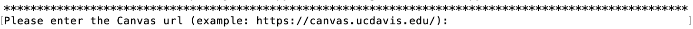

# CSV Canvas Grade Transfer
> An improvement/alternative (?) of the current Canvas method of uploading grades from CSV files.

## Table of Contents
* [General Info](#general-information)
* [Technologies Used](#technologies-used)
* [Features](#features)
* [Setup](#setup)
* [Workflow](#workflow)
* [Project Status](#project-status)
* [Room for Improvement](#room-for-improvement)
* [Acknowledgements](#acknowledgements)
* [Contact](#contact)
<!-- * [License](#license) -->

## General Information
This program transfers students' grades of one or more assignments from a CSV file to a Canvas course. 

## Technologies Used
- Python - version 3.8
  - Install [Python 3.8.0](https://www.python.org/downloads/release/python-380/).

## Features
- Simplify the grade transfer process by requiring only three things:
    1. Canvas url, 
    2. user's Canvas token
    3. the path to the user's CSV file. 

- Match students automatically by their emails and student IDs (SIDs) first, then match the rest of students by their
unique full names or last names and ask user to verify these name matches.

- Notify the user about which students' grades are not successfully transferred from the CSV file at the end of the program. 

## Setup
#### Make sure three things are available before running the program:
1. Canvas url 
    - Example: https://canvas.ucdavis.edu/
    
2. the Canvas token 
    - How to get Canvas API access tokens: https://community.canvaslms.com/t5/Admin-Guide/How-do-I-manage-API-access-tokens-as-an-admin/ta-p/89

3. the path to the CSV file on user's local computer

#### To run the program:

1. Install [CanvasAPI](https://github.com/ucfopen/canvasapi) by typing this command on the terminal and hitting <kbd>Enter</kbd>:

    `pip install canvasapi`

2. Clone this Git repository to a user chosen directory with git clone:   

    `git clone https://github.com/mfbutner/CanvasHelpers.git`

3. Inside the directory from step 2, go to the new sub-directory called "CanvasHelpers":   

    `cd CanvasHelpers`
   
4. Run the program using the `python3` command:

    `python3 start_grade_transfer.py`

5. Answer the first prompt which asks for the Canvas url:

    
    
6. Follow the prompts and happy uploading :)

## Workflow
- After given the Canvas url, the user's Canvas token, and the path to the CSV file, the program asks user to 
specify the course, assignment groups, and assignments to which they want the grades to be uploaded. 

- Then the program shows the first five rows from the CSV file and asks user to identify what each column represents.

- The program first matches students from the CSV file and the Canvas course by their emails and student IDs (SID), then 
it matches the leftover students who can't be matched previously by their unique full names or last names. Next, the 
program asks user to identify if each name-matched Canvas-CSV student pair is correct.

- Afterwards the program updates the matched (by emails, SIDs, or verified names) students' grades to Canvas. It informs 
user about the progress of sending each assignment's grade update request to Canvas.

- Lastly the program announces the CSV file students (full names, emails, and SID) whose grades are not transferred during
this grade upload. 

- Please visit [ExternalDocumentation](./ExternalDocumentation) for a more detailed workflow about this program. 

[----------LEFT HERE-----------]

## Project Status
The program is functional but it's not in the ideal state. More updates will be upcoming.

## Room for Improvement
To do:
- Upgrade the user interface from terminal command line to a local website.

- Find a more efficient algorithm to 
    1. Match students based on Email, SIDs, and names. 
    2. Link the student [----------LEFT HERE-----------]

- Fix TODOs in ExternalDocumentation

- Test more corner cases

- Add more comments to functions. 

## Acknowledgements
- This project uses the [CanvasAPI](https://github.com/ucfopen/canvasapi) package which served as a Python API wrapper for
instructor's Canvas learning management system (LMS).   

- Many thanks to Matthew Butner (mfbutner@ucdavis.edu), UC Davis CS instructor, to guide this project.

## Contact
Created by Qianhan "Janet" Zhang (jqhzhang@ucdavis.edu) - feel free to contact me!

